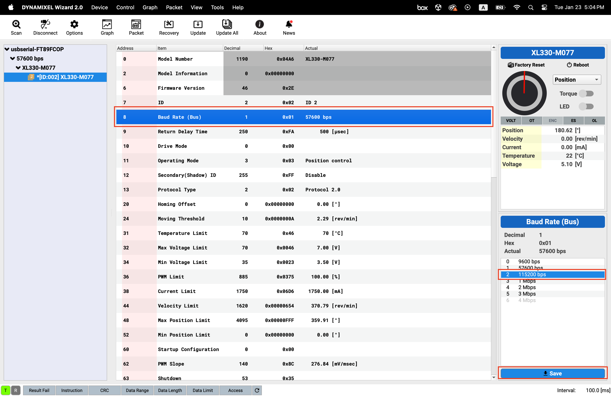
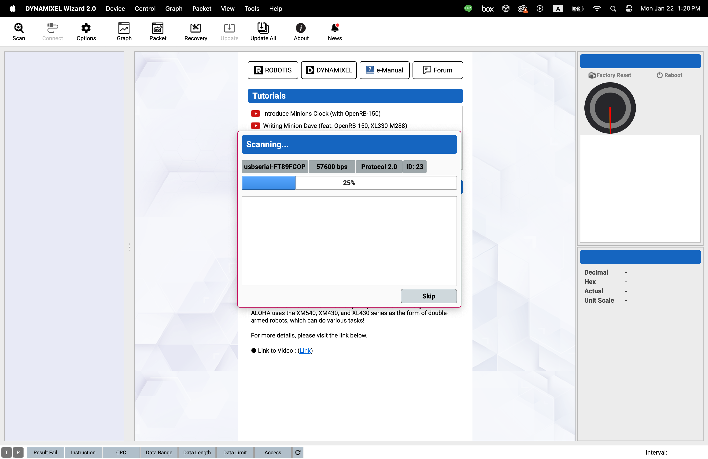
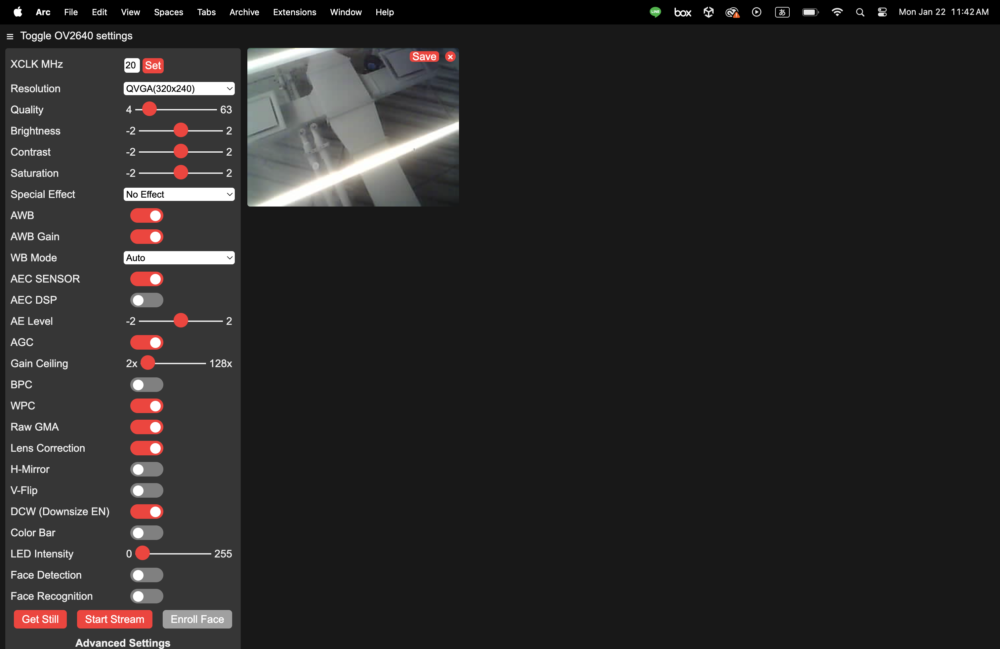
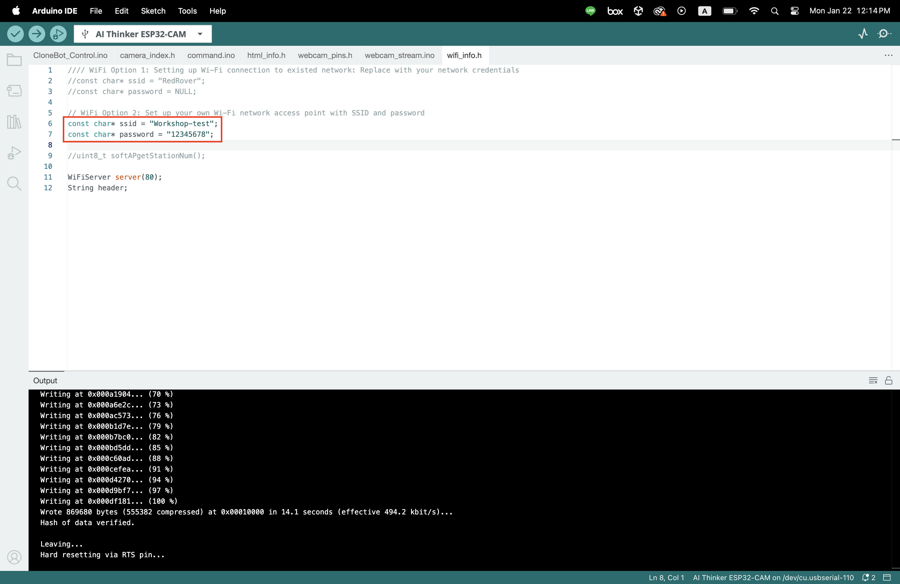
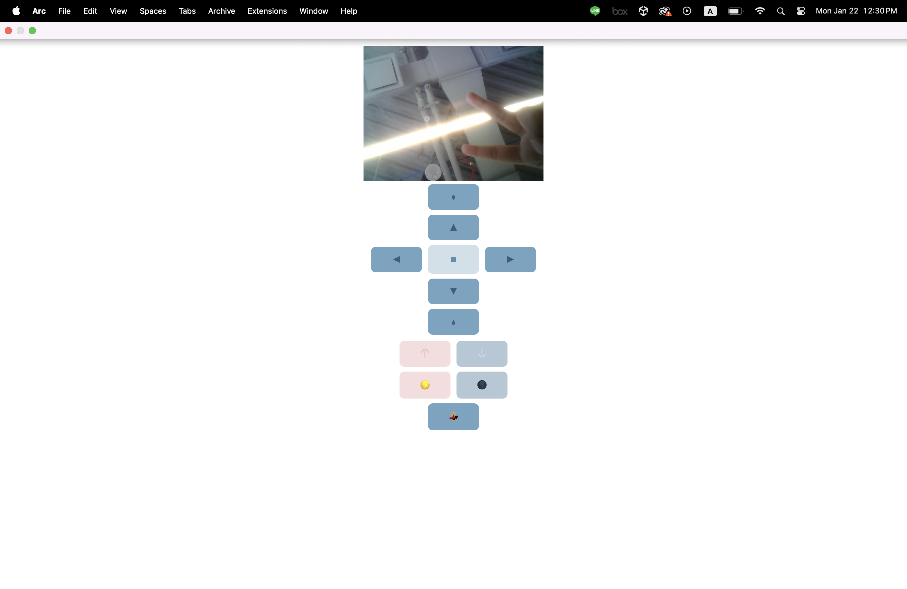
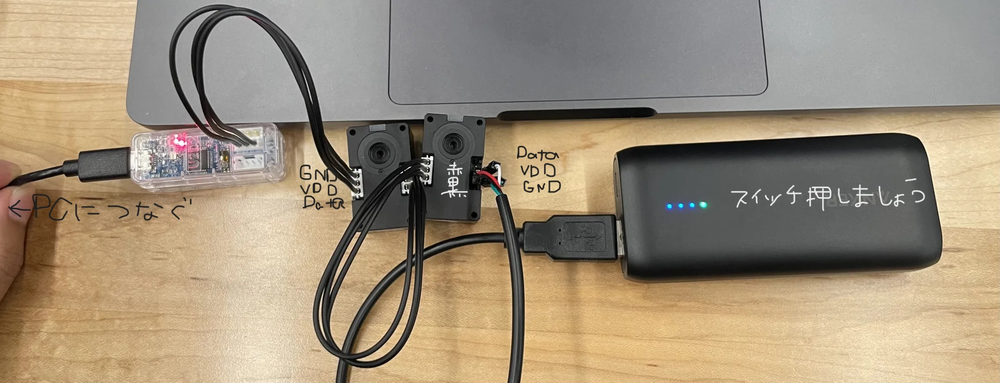

A slight modification from Dr. Rei Lee's [Conebot](https://github.com/rei039474/ConeBot)

# Parts（必要部品）:
* Computation: esp32-cam
* Motor Programmer: ROBOTIS U2D2 part
* Motors: DYNAMIXEL XL330-M077-T motor
* Wheels: omni wheels
* Breadboards: mini breadboard sets
* Power: power bank Anker 321
* Cable: usbc-to-c cable
* caster balls


# Dependency（準備）:
1. [Arduino IDE](https://www.arduino.cc/en/software)
2. Dr. Rei Lee's [package](https://github.com/rei039474/Dynamixel_XL330_Servo_Library) to control dynamixel motors (XL330 series)
Download by click code--> download ZIP
unzip ait and move the directoriy to `~/Documents/Arduino/libraries/`

3. [Dynamixel Wizard](https://emanual.robotis.com/docs/en/software/dynamixel/dynamixel_wizard2/)
4. Please refer to the following repo for the XL330 Servo library under Arduino IDE:  
[rei039474/Dynamixel_XL330_Servo_Library](https://github.com/rei039474/Dynamixel_XL330_Servo_Library)


# Steps:
## Part A: Dynamixel and motor setup
1. Download and install [Dynamixel Wizard](https://emanual.robotis.com/docs/en/software/dynamixel/dynamixel_wizard2/)  
   [Dynamixel Wizard](https://emanual.robotis.com/docs/en/software/dynamixel/dynamixel_wizard2/)をインストールする  

2. Connect computer to motors.  
   PCとモータとバッテリーを接続する。  
   > Laptop USB--> U2D2 microUSB-->right side of motor 1--> left side of motor 1--> right side of motor 2--> left side of the motor --> battery.
   Check the pinout of the U2D2 and dynamixels to make sure you are connecting them properly (VDD, GND, and Data, should connect to one another)
   U2D2とDynamixelの入力・出力を正しく接続すること
   

3. In the Dynamixel Wizard, scan the USB port for Baudrate 57600 to find the motors. After the motor is found, make sure torque is off, then change settings for both:  
   Dynamixel Wizardを起動し、モーターをスキャンする。モーターが発見されたら下記の要領でボードレートとIDの設定変更を行う。
   > 1. Baudrate to 115200 bps（ボードレートを115200bpsに設定）
   > 2. ID 1 and 2 respectively（それぞれのモータにIDを設定）
   > 3. Control mode to PWM (not velocity or position).
   > 4. Turn torque on and toggle the diagram to get it moving! You only have to do this once.

## Part B: ESP32 Board and webcam setup
1. Download and install [Arduino IDE](https://www.arduino.cc/en/software)  
   [Arduino IDE](https://www.arduino.cc/en/software)をインストールし起動する

2. Install the ESP32 Board (from espressif) in the Arduino IDE:
   下記を参考に、ESP32 Board (from espressif)をインストールする

   > 1. Tools--> Board --> Boards Manager... (左の順にオプションを選択し、Boards Managerウィンドウを開く)
   > 2. Type esp32 and select esp32 by Expressif　（「esp32」で検索し、「esp32 by Expressif」を選択する）
   > 3. Install(This may take a moment). (インストールに時間がかかる可能性があります）


3. Using the board and a microUSB, connect to ESP32 cam, flash and run a bit of sample code (try [CameraWebServer](https://randomnerdtutorials.com/esp32-cam-video-streaming-face-recognition-arduino-ide/)).
   基板とUSBを用いて、ESP32カメラをPCに接続する。その後、下記に示す要領でカメラWebサーバの起動を行う。

   > 1. Select the board by going to: tools-->boards> ESP32 Arduino --> select AI Thinker ESP32-CAM  (左の順にオプションを選択し、AI Thinker ESP32-CAMを開く) 
   > 2. Then select the port:tools--> port--> there should be something like /dev/usb***** on mac or COM*** on Windows.  (左の順にオプションを選択し、指定のポート経由でESP32へ接続を行う) 　
   > 3. then go to:File-->Examples-->ESP32-->Camera-->CameraWebServer
   put in your wifi credentials  (左の順にオプションを選択しスクリプトを開く。下記を参考にWi-Fi情報を更新する)
      ```
      const char* ssid = "REPLACE_WITH_YOUR_SSID";
      const char* password = "REPLACE_WITH_YOUR_PASSWORD";
      ```
      Uncomment this line（この行の行頭の"//"を削除） `#define CAMERA_MODEL_AI_THINKER ` 
      and comment out （この行の行頭に"//" を追加）`//#define CAMERA_MODEL_ESP_EYE `
      
   
   > 4. hit the green arrow button on the left to upload the code to the microcontroller  (画面左上にある緑路の矢印を押下し、スクリプトをデバイスにアップロードする) 

   > 5. if you go to tools--> serial monitor it will print out an IP address you can go to in a browser from a computer on the same network. (左の順にオプションを選択し、シリアルモニタ画面を表示させる。そこにIPアドレスが表示されるので、ブラウザ経由でそこにアクセスを行う)
         
   この画面が表示されたらOK！  

4. コントロールボタンを表示させる
   > 1. Download this repo and open the folder Conebot_Control in the Arduno IDE
   Conebot_Controlフォルダをローカルにダウンロードし、Arduno IDEで開く
      >> File-->Open-->Conebot-main-->Conebot_Control-->Conebot_Control.ino（左の順にオプションを選択し、ファイルを取り込む）
   > 2. You will also need the ESP32Servo library and the Dynamixel XL330 Arduino Library
   > 下記の方法で、ESP32ServoライブラリとDynamixel XL330ライブラリをダウンロードする 
      >> ESP32Servo: Sketch-->Include Library-->Library Manager-->Type ESP32Servo and install it.  
      >> Dynamixel XL330 Arduino Library: Sketch-->Include Library--> Add .ZIP Library and select Dynamixel XL330 Arduino Library.ZIP that we downloaded earlier 
   > 3. In `wifi_info.h`, set it to "WiFi Option 2: Set up your own Wi-Fi network access point with SSID and password" by commenting out the first option.
   > 先ほど開いたConebot_Control内のスクリプト`wifi_info.h`で任意のネットワーク名とパスワードを設定する。Wifi設定で、自分で設定したデバイスの名前とパスワードを選択し、接続する。  
   > 4. Upload the code onto the board, connect to its network (SSID and password are in `wifi_info.h`), and visit the IP address that it spits out in the Serial monitor. It should show you live video feed, as well as a button display! Try turning the LED on and off.  
    `Conebot_Control.ino`スクリプトをアップロード(画面左上緑色のボタンを押下）し、先ほど設定した名前のネットワークにPCを接続する。そして、シリアルモニタに表示されているIPアドレスにアクセスする。
    

## Part C: Connect Dynamixel and ESP32 on Breadboard
1. Set up the breadboard: hook up servo, ESP32 cam, battery, and motors. (Schematic included)
   下図のようにブレッドボードを設定し、ESP32カメラ、バッテリー、モータをワイヤにて繋げる 

2. Again, connect to the ESP32's network, and go to the same IP address. You should be able to see the video stream and control all of the motors!
   再びESP32カメラをネットワークに接続し、先ほどと同じIPアドレスにブラウザ経由でアクセスする。カメラが動いており、コントローラでモータを動かせたら準備完了！

    


3. Build your robots!
    Brainstorm your ideas for your robots. Prototype and build a superstructure
    これでロボットの基礎は完成です。どのような機能をつけるか等自由にアイデアを出していただき、プロトタイプを作成してください。

4. Done!
